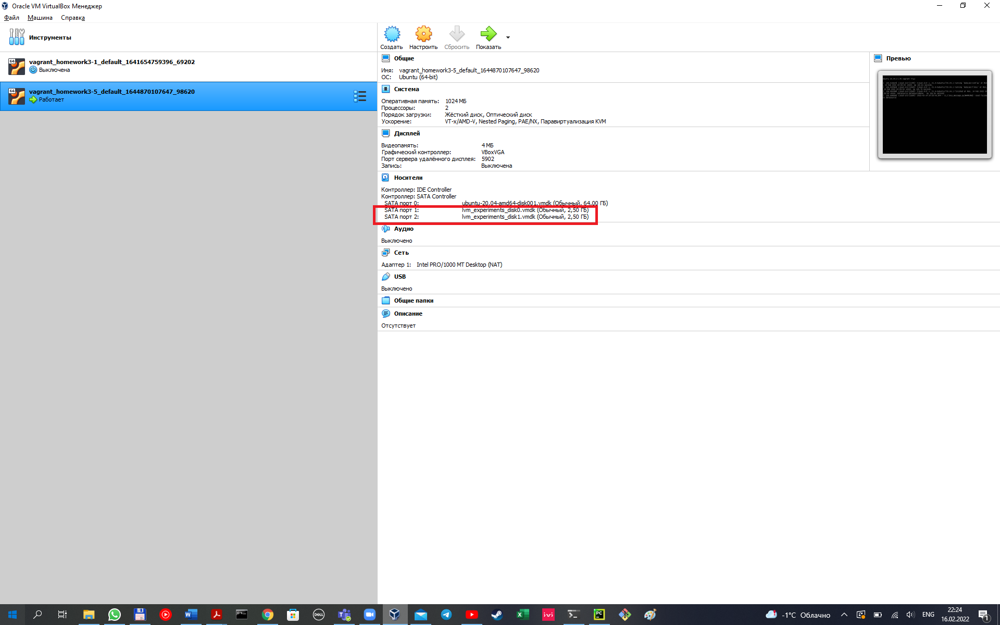

#_Домашнее задание занятию "Домашнее задание к занятию "3.5. Файловые системы"_ #
##Выполнил  - Каплин Владимир ##


1. Узнайте о sparse (разряженных) файлах.

```
Разрежённый файл (англ. sparse file) — файл, в котором последовательности нулевых байтов[1] 
заменены на информацию об этих последовательностях (список дыр).
```
2. Могут ли файлы, являющиеся жесткой ссылкой на один объект, иметь разные права доступа и владельца? Почему?
Ответ: не могут, при изменении ссылки или файла, поменяются права доступа и владелец у всех жестких ссылок и файл.
Не могут, т.к. жесткая ссылка - это ссылка на уровне ФС на место, которое занимает файл. По сути это указатель на файл, 
они имеют одинакову UID и соответственно права и владельца.

4. Сделайте vagrant destroy на имеющийся инстанс Ubuntu.

Решение: машина создана, скриншот ниже


4. Используя fdisk, разбейте первый диск на 2 раздела: 2 Гб, оставшееся пространство.

Посмотрим на существующие разделы:
```
vagrant@vagrant:~$ sudo fdisk -l
Disk /dev/sdb: 2.51 GiB, 2684354560 bytes, 5242880 sectors
Disk model: VBOX HARDDISK
Units: sectors of 1 * 512 = 512 bytes
Sector size (logical/physical): 512 bytes / 512 bytes
I/O size (minimum/optimal): 512 bytes / 512 bytes


Disk /dev/sdc: 2.51 GiB, 2684354560 bytes, 5242880 sectors
Disk model: VBOX HARDDISK
Units: sectors of 1 * 512 = 512 bytes
Sector size (logical/physical): 512 bytes / 512 bytes
I/O size (minimum/optimal): 512 bytes / 512 bytes
```
- Разметим раздел /dev/sdb
```
vagrant@vagrant:~$ sudo fdisk -l /dev/sdb
Disk /dev/sdb: 2.51 GiB, 2684354560 bytes, 5242880 sectors
Disk model: VBOX HARDDISK
Units: sectors of 1 * 512 = 512 bytes
Sector size (logical/physical): 512 bytes / 512 bytes
I/O size (minimum/optimal): 512 bytes / 512 bytes
```
- Зайдем в утилиту FDISK
```
vagrant@vagrant:~$ sudo fdisk /dev/sdb

Welcome to fdisk (util-linux 2.34).
Changes will remain in memory only, until you decide to write them.
Be careful before using the write command.

Device does not contain a recognized partition table.
Created a new DOS disklabel with disk identifier 0x61648611.```
```
- создадим таблицу разделов опцией g
```
Command (m for help): g
Created a new GPT disklabel (GUID: CE44518B-DFE8-904F-A601-04B726E1FFAA).
```

- создадим новый раздел 2ГБ опцией n
```
Command (m for help): n
Partition number (1-128, default 1): 4
First sector (2048-5242846, default 2048):
Last sector, +/-sectors or +/-size{K,M,G,T,P} (2048-5242846, default 5242846): +2G

Created a new partition 4 of type 'Linux filesystem' and of size 2 GiB.
```
- Проверим опцией p остаток неразмеченного места на диске
```
Command (m for help): p
Disk /dev/sdb: 2.51 GiB, 2684354560 bytes, 5242880 sectors
Disk model: VBOX HARDDISK
Units: sectors of 1 * 512 = 512 bytes
Sector size (logical/physical): 512 bytes / 512 bytes
I/O size (minimum/optimal): 512 bytes / 512 bytes
Disklabel type: gpt
Disk identifier: CE44518B-DFE8-904F-A601-04B726E1FFAA

Device     Start     End Sectors Size Type
/dev/sdb4   2048 4196351 4194304   2G Linux filesystem
```

- Создадим опцией n второй раздел на оставщееся место.

```
Command (m for help): n
Partition number (1-3,5-128, default 1): 5
First sector (4196352-5242846, default 4196352):
Last sector, +/-sectors or +/-size{K,M,G,T,P} (4196352-5242846, default 5242846): 5242846

Created a new partition 5 of type 'Linux filesystem' and of size 511 MiB.
```
- Проверим таблицу разделов опцией p и сохраним результат опцией w
```
Command (m for help): p
Disk /dev/sdb: 2.51 GiB, 2684354560 bytes, 5242880 sectors
Disk model: VBOX HARDDISK
Units: sectors of 1 * 512 = 512 bytes
Sector size (logical/physical): 512 bytes / 512 bytes
I/O size (minimum/optimal): 512 bytes / 512 bytes
Disklabel type: gpt
Disk identifier: CE44518B-DFE8-904F-A601-04B726E1FFAA

Device       Start     End Sectors  Size Type
/dev/sdb4     2048 4196351 4194304    2G Linux filesystem
/dev/sdb5  4196352 5242846 1046495  511M Linux filesystem
```

```
Command (m for help): w
The partition table has been altered.
Calling ioctl() to re-read partition table.
Syncing disks.
```

Диск размечен.

5. Используя sfdisk, перенесите данную таблицу разделов на второй диск.

Решение:
C помощью man находим, что ключ -d выводит в стардтный stdout таблицу разделов.

```
vagrant@vagrant:~$ sudo sfdisk -d /dev/sdb
label: gpt
label-id: CE44518B-DFE8-904F-A601-04B726E1FFAA
device: /dev/sdb
unit: sectors
first-lba: 2048
last-lba: 5242846

/dev/sdb4 : start=        2048, size=     4194304, type=0FC63DAF-8483-4772-8E79-3D69D8477DE4, uuid=80ECAA31-15CF-3C4C-A57B-4D8170F149F1
/dev/sdb5 : start=     4196352, size=     1046495, type=0FC63DAF-8483-4772-8E79-3D69D8477DE4, uuid=27E7EB9A-2A5E-7640-BBDE-B3E317B33DEC
```
Объединяя через pipeline, создаем аналогичные разделы на новом диске /dev/sdc

```
vagrant@vagrant:~$ sudo sfdisk -d /dev/sdb | sudo sfdisk /dev/sdc
Checking that no-one is using this disk right now ... OK

Disk /dev/sdc: 2.51 GiB, 2684354560 bytes, 5242880 sectors
Disk model: VBOX HARDDISK
Units: sectors of 1 * 512 = 512 bytes
Sector size (logical/physical): 512 bytes / 512 bytes
I/O size (minimum/optimal): 512 bytes / 512 bytes

>>> Script header accepted.
>>> Script header accepted.
>>> Script header accepted.
>>> Script header accepted.
>>> Script header accepted.
>>> Script header accepted.
>>> Created a new GPT disklabel (GUID: CE44518B-DFE8-904F-A601-04B726E1FFAA).
/dev/sdc1: Created a new partition 4 of type 'Linux filesystem' and of size 2 GiB.
/dev/sdc5: Created a new partition 5 of type 'Linux filesystem' and of size 511 MiB.
/dev/sdc6: Done.

New situation:
Disklabel type: gpt
Disk identifier: CE44518B-DFE8-904F-A601-04B726E1FFAA

Device       Start     End Sectors  Size Type
/dev/sdc4     2048 4196351 4194304    2G Linux filesystem
/dev/sdc5  4196352 5242846 1046495  511M Linux filesystem

The partition table has been altered.
Calling ioctl() to re-read partition table.
Syncing disks.
vagrant@vagrant:~$
```

Разделы созданы:
```
Disk /dev/sdb: 2.51 GiB, 2684354560 bytes, 5242880 sectors
Disk model: VBOX HARDDISK
Units: sectors of 1 * 512 = 512 bytes
Sector size (logical/physical): 512 bytes / 512 bytes
I/O size (minimum/optimal): 512 bytes / 512 bytes
Disklabel type: gpt
Disk identifier: CE44518B-DFE8-904F-A601-04B726E1FFAA

Device       Start     End Sectors  Size Type
/dev/sdb4     2048 4196351 4194304    2G Linux filesystem
/dev/sdb5  4196352 5242846 1046495  511M Linux filesystem


Disk /dev/sdc: 2.51 GiB, 2684354560 bytes, 5242880 sectors
Disk model: VBOX HARDDISK
Units: sectors of 1 * 512 = 512 bytes
Sector size (logical/physical): 512 bytes / 512 bytes
I/O size (minimum/optimal): 512 bytes / 512 bytes
Disklabel type: gpt
Disk identifier: CE44518B-DFE8-904F-A601-04B726E1FFAA

Device       Start     End Sectors  Size Type
/dev/sdc4     2048 4196351 4194304    2G Linux filesystem
/dev/sdc5  4196352 5242846 1046495  511M Linux filesystem
```

6. Соберите mdadm RAID1 на паре разделов 2 Гб

Создадим:
```
vagrant@vagrant:~$ sudo mdadm --create --verbose /dev/md0 --level=1 --raid-devices=2 /dev/sdb4 /dev/sdc4
mdadm: Note: this array has metadata at the start and
    may not be suitable as a boot device.  If you plan to
    store '/boot' on this device please ensure that
    your boot-loader understands md/v1.x metadata, or use
    --metadata=0.90
mdadm: size set to 2094080K
Continue creating array? y
mdadm: Defaulting to version 1.2 metadata
mdadm: array /dev/md0 started.
```
Проверим:
```
vagrant@vagrant:~$ cat /proc/mdstat
Personalities : [linear] [multipath] [raid0] [raid1] [raid6] [raid5] [raid4] [raid10]
md0 : active raid1 sdc4[1] sdb4[0]
      2094080 blocks super 1.2 [2/2] [UU]
```
7. Соберите mdadm RAID0 на второй паре маленьких разделов.
Создадим:
```
vagrant@vagrant:~$ sudo mdadm --create --verbose /dev/md1 --level=0 --raid-devices=2 /dev/sdb5 /dev/sdc5
mdadm: chunk size defaults to 512K
mdadm: Defaulting to version 1.2 metadata
mdadm: array /dev/md1 started.

Disk /dev/md0: 1.102 GiB, 2144337920 bytes, 4188160 sectors
Units: sectors of 1 * 512 = 512 bytes
Sector size (logical/physical): 512 bytes / 512 bytes
I/O size (minimum/optimal): 512 bytes / 512 bytes


Disk /dev/md1: 1017 MiB, 1066401792 bytes, 2082816 sectors
Units: sectors of 1 * 512 = 512 bytes
Sector size (logical/physical): 512 bytes / 512 bytes
I/O size (minimum/optimal): 524288 bytes / 1048576 bytes
```
Проверим:
```
vagrant@vagrant:~$ cat /proc/mdstat
Personalities : [linear] [multipath] [raid0] [raid1] [raid6] [raid5] [raid4] [raid10]
md1 : active raid0 sdc5[1] sdb5[0]
      1041408 blocks super 1.2 512k chunks

md0 : active raid1 sdc4[1] sdb4[0]
      2094080 blocks super 1.2 [2/2] [UU]
```
Перегрузим машину, raid остались.
```
vagrant@vagrant:~$ cat /proc/mdstat
Personalities : [raid1] [raid0] [linear] [multipath] [raid6] [raid5] [raid4] [raid10]
md126 : active (auto-read-only) raid1 sdb4[0] sdc4[1]
      2094080 blocks super 1.2 [2/2] [UU]

md127 : active raid0 sdb5[0] sdc5[1]
      1041408 blocks super 1.2 512k chunks
```

8. Создайте 2 независимых PV на получившихся md-устройствах.

Создадим:
```
vagrant@vagrant:~$ sudo pvcreate /dev/md126
  Physical volume "/dev/md126" successfully created.
vagrant@vagrant:~$ sudo pvcreate /dev/md127
  Physical volume "/dev/md127" successfully created.
vagrant@vagrant:~$
```
Проверим:
```
vagrant@vagrant:~$ sudo pvscan
  PV /dev/sda3    VG ubuntu-vg       lvm2 [<63.00 GiB / <31.50 GiB free]
  PV /dev/md126                      lvm2 [<2.00 GiB]
  PV /dev/md127                      lvm2 [1017.00 MiB]
  Total: 3 [<65.99 GiB] / in use: 1 [<63.00 GiB] / in no VG: 2 [2.99 GiB]
```
9. Создайте общую volume-group на этих двух PV.
```
vagrant@vagrant:~$ sudo vgcreate raid_kaplin01 /dev/md126 /dev/md127
  Volume group "raid_kaplin01" successfully created
```

```
vagrant@vagrant:~$ sudo vgdisplay
 --- Volume group ---
  VG Name               raid_kaplin01
  System ID
  Format                lvm2
  Metadata Areas        2
  Metadata Sequence No  1
  VG Access             read/write
  VG Status             resizable
  MAX LV                0
  Cur LV                0
  Open LV               0
  Max PV                0
  Cur PV                2
  Act PV                2
  VG Size               <2.99 GiB
  PE Size               4.00 MiB
  Total PE              765
  Alloc PE / Size       0 / 0
  Free  PE / Size       765 / <2.99 GiB
  VG UUID               tNJtMx-VcvH-oJh9-pXKZ-mCzs-QdqS-4Fj1S8
 ```
10. Создайте LV размером 100 Мб, указав его расположение на PV с RAID0.

Создадим:
```
vagrant@vagrant:~$ sudo lvcreate -L 100M -n disk_101 raid_kaplin01 /dev/md127
  Logical volume "disk_101" created.
```
Проверим:
```
vagrant@vagrant:~$ sudo lvdisplay -m
  --- Logical volume ---
  LV Path                /dev/raid_kaplin01/disk_101
  LV Name                disk_101
  VG Name                raid_kaplin01
  LV UUID                Wg3fbm-qqgZ-tZEF-0HFD-PkBO-eyvj-05YXVJ
  LV Write Access        read/write
  LV Creation host, time vagrant, 2022-02-17 20:03:38 +0000
  LV Status              available
  # open                 0
  LV Size                100.00 MiB
  Current LE             25
  Segments               1
  Allocation             inherit
  Read ahead sectors     auto
  - currently set to     4096
  Block device           253:2

  --- Segments ---
  Logical extents 0 to 24:
    Type                linear
    Physical volume     /dev/md127
    Physical extents    0 to 24
```

11. Создайте mkfs.ext4 ФС на получившемся LV.
Создадим:
```
vagrant@vagrant:~$  sudo mkfs.ext4 /dev/raid_kaplin01/disk_101
mke2fs 1.45.5 (07-Jan-2020)
Creating filesystem with 25600 4k blocks and 25600 inodes

Allocating group tables: done
Writing inode tables: done
Creating journal (1024 blocks): done
Writing superblocks and filesystem accounting information: done
```
Проверим,  что создана файловая  система ext4
```
vagrant@vagrant:~$ sudo file -sL /dev/raid_kaplin01/disk_101
/dev/raid_kaplin01/disk_101: Linux rev 1.0 ext4 filesystem data, UUID=dbf918b8-3d28-462a-b332-41116e2d3f14 (extents) (64bit) (large files) (huge files)
```

12. Смонтируйте этот раздел в любую директорию, например, /tmp/new.

Создадим папку /tmp/new
```
vagrant@vagrant:~$ cd /tmp
vagrant@vagrant:/tmp$ mkdir new
```
Выполним мотирование
```
vagrant@vagrant:/tmp$ sudo mount /dev/raid_kaplin01/disk_101 /tmp/new
```
Проверим
```
vagrant@vagrant:/tmp$ sudo mount | grep "raid_kaplin01-"
/dev/mapper/raid_kaplin01-disk_101 on /tmp/new type ext4 (rw,relatime,stripe=256)
```

13. Поместите туда тестовый файл, например wget https://mirror.yandex.ru/ubuntu/ls-lR.gz -O /tmp/new/test.gz.

Скопируем файл:
```
vagrant@vagrant:/tmp/new$ sudo wget https://mirror.yandex.ru/ubuntu/ls-lR.gz -O test.gz
--2022-02-17 21:08:23--  https://mirror.yandex.ru/ubuntu/ls-lR.gz
Resolving mirror.yandex.ru (mirror.yandex.ru)... 213.180.204.183, 2a02:6b8::183
Connecting to mirror.yandex.ru (mirror.yandex.ru)|213.180.204.183|:443... connected.
HTTP request sent, awaiting response... 200 OK
Length: 22367262 (21M) [application/octet-stream]
Saving to: ‘test.gz’

test.gz                                              100%[===================================================================================================================>]  21.33M  19.8MB/s    in 1.1s

2022-02-17 21:08:24 (19.8 MB/s) - ‘test.gz’ saved [22367262/22367262]

vagrant@vagrant:/tmp/new$ ls -al
total 21868
drwxr-xr-x  3 root root     4096 Feb 17 21:08 .
drwxrwxrwt 13 root root     4096 Feb 17 21:00 ..
drwx------  2 root root    16384 Feb 17 20:35 lost+found
-rw-r--r--  1 root root 22367262 Feb 17 17:16 test.gz
vagrant@vagrant:/tmp/new$
```

14. Прикрепите вывод lsblk.
Решение:
```
vagrant@vagrant:/tmp/new$ lsblk -o +FSTYPE,LABEL
NAME                         MAJ:MIN RM  SIZE RO TYPE  MOUNTPOINT        FSTYPE            LABEL
loop0                          7:0    0 55.4M  1 loop  /snap/core18/2128 squashfs
loop1                          7:1    0 55.5M  1 loop  /snap/core18/2284 squashfs
loop2                          7:2    0 61.9M  1 loop  /snap/core20/1328 squashfs
loop3                          7:3    0 70.3M  1 loop  /snap/lxd/21029   squashfs
loop4                          7:4    0 67.2M  1 loop  /snap/lxd/21835   squashfs
loop5                          7:5    0 43.6M  1 loop  /snap/snapd/14978 squashfs
sda                            8:0    0   64G  0 disk
├─sda1                         8:1    0    1M  0 part
├─sda2                         8:2    0    1G  0 part  /boot             ext4
└─sda3                         8:3    0   63G  0 part                    LVM2_member
  └─ubuntu--vg-ubuntu--lv    253:0    0 31.5G  0 lvm   /                 ext4
sdb                            8:16   0  2.5G  0 disk
├─sdb4                         8:20   0    2G  0 part                    linux_raid_member vagrant:0
│ └─md126                      9:126  0    2G  0 raid1                   LVM2_member
└─sdb5                         8:21   0  511M  0 part                    linux_raid_member vagrant:1
  └─md127                      9:127  0 1017M  0 raid0                   LVM2_member
    └─raid_kaplin01-disk_101 253:2    0  100M  0 lvm   /tmp/new          ext4
sdc                            8:32   0  2.5G  0 disk
├─sdc4                         8:36   0    2G  0 part                    linux_raid_member vagrant:0
│ └─md126                      9:126  0    2G  0 raid1                   LVM2_member
└─sdc5                         8:37   0  511M  0 part                    linux_raid_member vagrant:1
  └─md127                      9:127  0 1017M  0 raid0                   LVM2_member
    └─raid_kaplin01-disk_101 253:2    0  100M  0 lvm   /tmp/new          ext4```

```

15. Протестируйте целостность файла:
```
root@vagrant:~# gzip -t /tmp/new/test.gz
root@vagrant:~# echo $?
0
```

Решение:
```
vagrant@vagrant:/tmp/new$ gzip -t /tmp/new/test.gz
vagrant@vagrant:/tmp/new$ echo $?
0
```
16. Используя pvmove, переместите содержимое PV с RAID0 на RAID1.

Переместим disk_101  с /dev/md127 (Riad0)  на /dev/md126 (Raid1)
```
vagrant@vagrant:/tmp/new$ sudo pvmove -n disk_101 /dev/md127 /dev/md126
  /dev/md127: Moved: 88.00%
```
Проверим:

```
vagrant@vagrant:/tmp/new$ lsblk -o +FSTYPE,LABEL
NAME                         MAJ:MIN RM  SIZE RO TYPE  MOUNTPOINT        FSTYPE            LABEL
loop0                          7:0    0 55.4M  1 loop  /snap/core18/2128 squashfs
loop1                          7:1    0 55.5M  1 loop  /snap/core18/2284 squashfs
loop2                          7:2    0 61.9M  1 loop  /snap/core20/1328 squashfs
loop3                          7:3    0 70.3M  1 loop  /snap/lxd/21029   squashfs
loop4                          7:4    0 67.2M  1 loop  /snap/lxd/21835   squashfs
loop5                          7:5    0 43.6M  1 loop  /snap/snapd/14978 squashfs
sda                            8:0    0   64G  0 disk
├─sda1                         8:1    0    1M  0 part
├─sda2                         8:2    0    1G  0 part  /boot             ext4
└─sda3                         8:3    0   63G  0 part                    LVM2_member
  └─ubuntu--vg-ubuntu--lv    253:0    0 31.5G  0 lvm   /                 ext4
sdb                            8:16   0  2.5G  0 disk
├─sdb4                         8:20   0    2G  0 part                    linux_raid_member vagrant:0
│ └─md126                      9:126  0    2G  0 raid1                   LVM2_member
│   └─raid_kaplin01-disk_101 253:2    0  100M  0 lvm   /tmp/new          ext4
└─sdb5                         8:21   0  511M  0 part                    linux_raid_member vagrant:1
  └─md127                      9:127  0 1017M  0 raid0                   LVM2_member
sdc                            8:32   0  2.5G  0 disk
├─sdc4                         8:36   0    2G  0 part                    linux_raid_member vagrant:0
│ └─md126                      9:126  0    2G  0 raid1                   LVM2_member
│   └─raid_kaplin01-disk_101 253:2    0  100M  0 lvm   /tmp/new          ext4
└─sdc5                         8:37   0  511M  0 part                    linux_raid_member vagrant:1
  └─md127                      9:127  0 1017M  0 raid0                   LVM2_member
```

17. Сделайте --fail на устройство в вашем RAID1 md.

vagrant@vagrant:/tmp/new$ sudo mdadm --fail /dev/md126 /dev/sdb4
mdadm: set /dev/sdb4 faulty in /dev/md126

18. Подтвердите выводом dmesg, что RAID1 работает в деградированном состоянии.

Система находится в деградированном состоянии:
```
vagrant@vagrant:/tmp/new$ dmesg | grep 'md126'
[    5.262376] md/raid1:md126: active with 2 out of 2 mirrors
[    5.279190] md126: detected capacity change from 0 to 2144337920
[48124.625992] md/raid1:md126: Disk failure on sdb4, disabling device.
               md/raid1:md126: Operation continuing on 1 devices.
```
19. Протестируйте целостность файла, несмотря на "сбойный" диск он должен продолжать быть доступен:
```
root@vagrant:~# gzip -t /tmp/new/test.gz
root@vagrant:~# echo $?
0
```
Тестирование, файл проходит тестирование успешно.
```
vagrant@vagrant:/tmp/new$ gzip -t /tmp/new/test.gz
vagrant@vagrant:/tmp/new$ echo $?
0
```

20. Погасите тестовый хост, vagrant destroy.
Выполнено.